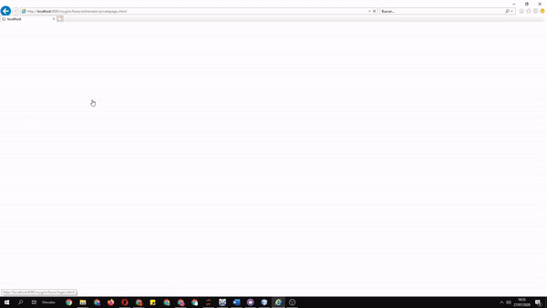

Enterprise Application
----------------------------------------------------

Introduction
============

The project is an example of an Enterprise Application created with JEE for a Membership Club.

Requirements
============

- NetBeans Platform SDK 12.0						

- Java EE						

- HTML5/JavaScript						

- PHP						

- GlassFish Server 5.1.1		

- MySQL	8.0		

Getting Started
===============

You will need to load the database and complete all the server requirements posted in the memo inside the project.

